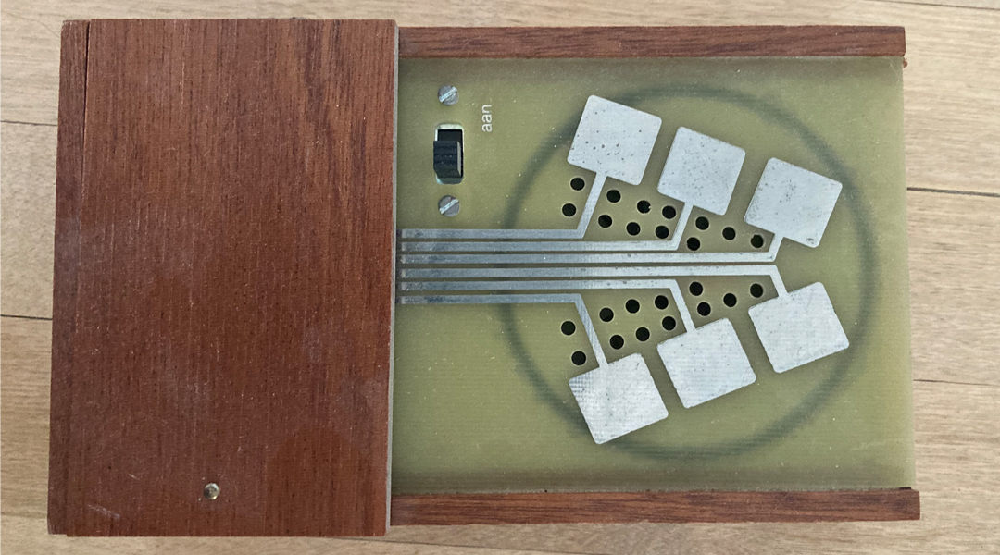
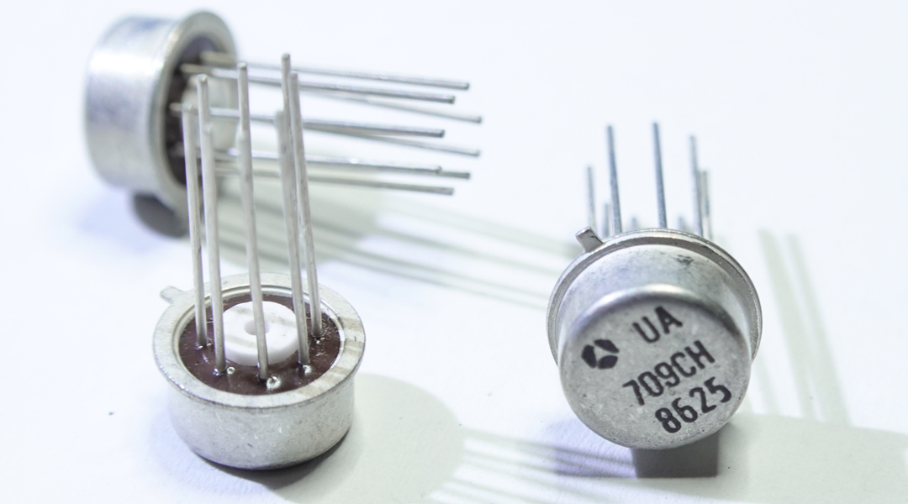
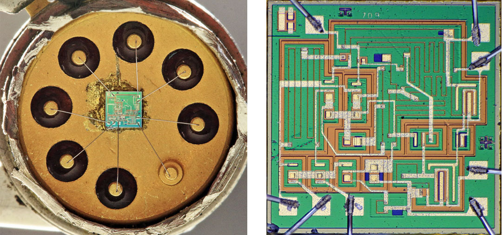
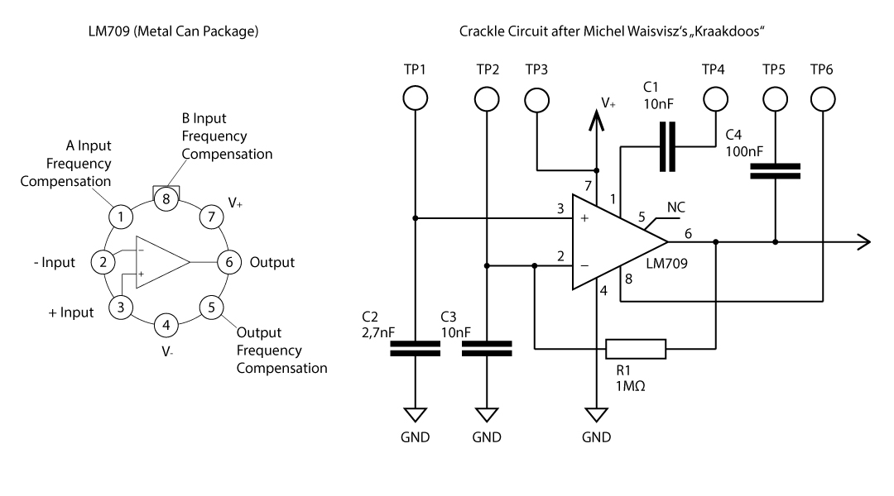
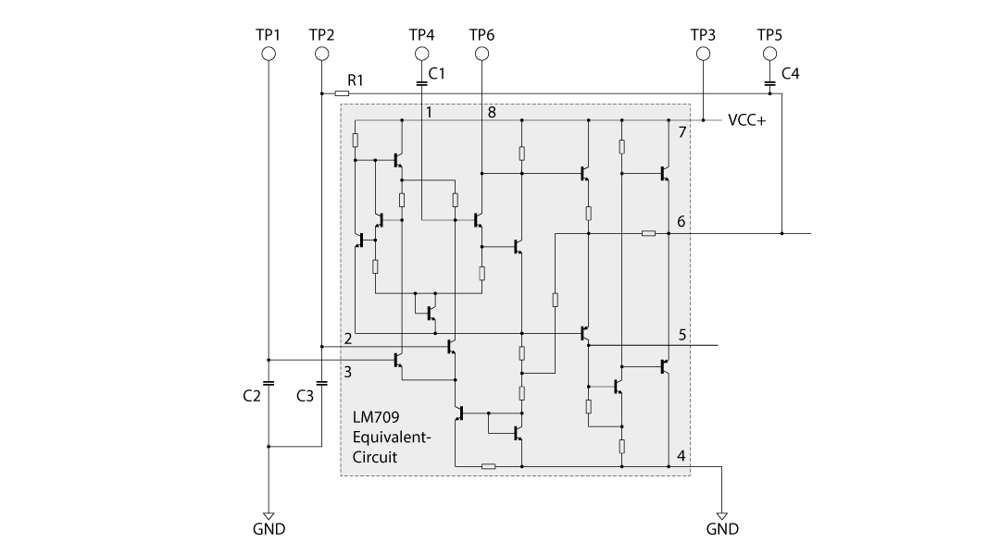
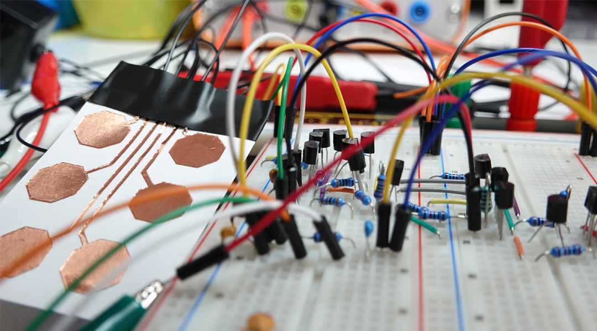
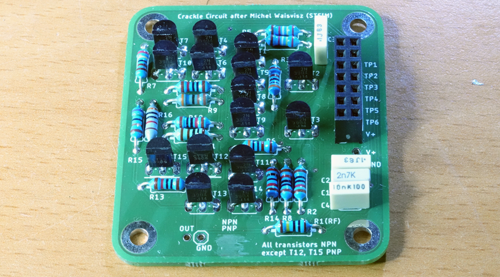

# Crackle Circuit

> Discrete-transistor recreation of Michel Waisvisz's *Cracklebox*, replacing the obsolete LM709 op-amp with an equivalent built from individual transistors and resistors.

  

|                       |                                                  |
| :-------------------- | :----------------------------------------------- |
| **Project**           | Crackle Circuit                                  |
| **Status**            | Closed                                           |
| **Started**           | February 2021                                    |
| **Completed**         | March 2021                                       |
| **Duration**          | ~1 month                                         |
| **License (hardware/docs)** | [CC-BY-4.0](cc-by-4.0.md)                  |
| **License (code)**    | [MIT](license-mit.md)                            |

---

## About

In addition to sensors or other control elements like potentiometers, force-sensing resistors, or similar components, touching dedicated connection points in a circuit will also affect its behavior. The human body can add various parameters such as resistance or capacitance. The conductivity of human skin introduced into a circuit varies greatly, just like the capacitance of the human body. Moisture (sweat), pressure, or even the surroundings define the actual electrical values and make it difficult to predict their effect on a circuit. In this context, the *crackle box* should be mentioned as a remarkable example.

*Crackle Box. Photo: Till Kniola*

The crackle box is a touch-controlled electronic instrument, developed in the 1970s by [Michel Waisvisz](https://de.wikipedia.org/wiki/Michel_Waisvisz) (\*1949 Leiden † 2008 Amsterdam) at [STEIM](https://de.wikipedia.org/wiki/Steim "Studio voor ElektroInstrumental Muziek") in Amsterdam. Its beginnings date back to the 1960s. It is a small, battery-operated wooden case (14 × 8 × 3 cm), like a cigar box, with a visible circuit board featuring six distinctive touch points (~1 cm² each) and an on/off switch. Underneath the touch surface is a built-in loudspeaker. The vibrating air can pass through a number of holes in the PCB between the touch surfaces. The instrument produces random noise, clicks and plops, or oscillates when touched with fingers. The circuit inside is just an op-amp in an inverting configuration, while many circuit points and most pins of the op-amp are made available on the outside of the device as conductive touch pads.

*LM709 TO-5 metal can packages*

The device makes use of the LM709/μA709 op-amp (originally National Semiconductor, then Texas Instruments), one of the earliest monolithic operational amplifiers, created by [Robert Widlar](https://en.wikipedia.org/wiki/Bob_Widlar). Its design concept and performance were soon surpassed by its successor, the LM741. While the latter is still in production, the LM709 has been discontinued. Compared with modern op-amps, the LM709 lacks an output buffer stage, which means it is not short-circuit proof. Furthermore, it does not have internal frequency compensation: external components must be added to limit the op-amp's bandwidth and prevent unwanted oscillation. Richard Kaußler has produced a detailed analysis of the LM709, which can be found [here](https://www.richis-lab.de/Opamp20.htm "LM709"). His [website](https://www.richis-lab.de/ "Richi's Lab") (in German) is a good resource for in-depth information about the internal structure of various ICs.

*Die of an LM709 op-amp. Photo: Richard Kaußler*

The image above shows the [die](https://en.wikipedia.org/wiki/Die_(integrated_circuit)) of the LM709 embedded in a TO-5 package, alongside a close-up. The die is the integrated circuit made of silicon. The design of the crackle box focuses on the imperfections of the LM709 and its special features, particularly its external frequency compensation. Michel Waisvisz's crackle box is therefore an early example of circuit bending and the unconventional use of electronic components. The crackle box was reissued over the following decades as assembly kits, and could still be ordered directly from STEIM. STEIM itself ceased to exist as an organisation at the end of 2020, after the Dutch arts council ended its structural funding. See [assets/documents/sources.md](assets/documents/sources.md) for further reading.

*LM709 pinout and schematic of Michel Waisvisz's crackle box*

## Approach: substituting the LM709 with discrete components

As mentioned above, the LM709 is out of production and most modern op-amps are internally frequency-compensated and achieve high stability during operation. For the crackle box, the LM709 cannot simply be substituted with another op-amp without losing the instrument's character. This is part of the broader problem of obsolescence in the field of historical electronic instruments. One approach to circumvent it is to look more closely at the LM709 itself: the internal schematic can be found in its datasheet.

*Schematic with LM709 equivalent internal circuit*

For most applications, building an integrated circuit from discrete parts leads to a significant degradation in performance. This is because the components within an IC are fabricated to precisely meet the needs of the circuit.

*Breadboard with discrete components substituting the LM709*

Since the crackle box doesn't rely on precise operation but rather on randomness, standard transistors can be used. Both schematics presented here omit the push-pull speaker driver, which is built from two complementary pairs of transistors. Substituting the obsolete LM709 with discrete components, specifically transistors and resistors, brings an equivalent crackle circuit into being.

*Crackle board*

## Repository contents

| Folder                | Contents                                                                          |
| :-------------------- | :-------------------------------------------------------------------------------- |
| `assets/`             | All project content (see subfolders below)                                        |
| `assets/eagle/`       | EAGLE schematic and board source files (Autodesk EAGLE 9 / Fusion Electronics)    |
| `assets/schematic/`   | PDF/SVG exports of the schematic for offline viewing                              |
| `assets/gerber/`      | Gerber and drill files for PCB fabrication                                        |
| `assets/bom/`         | Bill of materials with Mouser and manufacturer part numbers                       |
| `assets/documents/`   | External references (linked, not bundled). See [sources.md](assets/documents/sources.md) |
| `assets/img/`         | Project photos and figures used in this README                                    |

## Status

The board in this repository is the prototype as fabricated in March 2021 and has not been fully re-verified since. A transistor may be in the wrong orientation somewhere in the design (schematic symbol, footprint, or board file). Please do not order multiple PCBs from this design yet. I will check the board soon and post any errata here, although the repository is otherwise closed.

The design is a small (~50 × 55 mm) two-layer through-hole PCB populated from the [Bill of Materials](assets/bom/readme.md): metal-film resistors, film capacitors, 13× 2N3904 (NPN) and 2× 2N3906 (PNP) in TO-92, and a 2×7 pin header. Power follows the original LM709 setup, a small bipolar (±9 V) or single-supply battery arrangement; the circuit is forgiving.

## License

The hardware design files (schematic, board, Gerbers) and this documentation are released under [Creative Commons Attribution 4.0 International (CC-BY-4.0)](cc-by-4.0.md). Any code or firmware in this repository (none at present, included for future contributions) is released under [the MIT License](license-mit.md).

When using or adapting the design, please credit:

> *Lorenz Schwarz, Crackle Circuit (2021). https://github.com/SCLW/Crackle-Circuit*

A [`CITATION.cff`](CITATION.cff) file is provided so GitHub will surface a *"Cite this repository"* button automatically.

## Credits

- **Original concept:** Michel Waisvisz, STEIM (Amsterdam, 1969–2020)
- **LM709 op-amp:** Robert Widlar, National Semiconductor (1965)
- **Photo *Crackle Box*:** Till Kniola
- **Photo *LM709 die*:** Richard Kaußler, [Richi's Lab](https://www.richis-lab.de/)
- **Discrete substitution and PCB design:** Lorenz Schwarz (2021)

## Related work

The Crackle Circuit belongs to a broader family of touch-controlled DIY noise instruments. The most direct kindred spirit is John Richards's *Dirty Electronics* project (Leicester, since 2003), which has produced a long line of cracklebox-style touch instruments around different cheap ICs, notably a build around a CMOS hex inverter (the 4049, used as a chaotic oscillator in the Forrest-Mims tradition) and another around the LM358 dual op-amp. Both are excellent points of comparison for the Crackle Circuit and worth seeking out for anyone interested in the lineage. See <https://www.dirtyelectronics.org/>.

## Further reading

See [`assets/documents/sources.md`](assets/documents/sources.md) for links to the LM709 datasheet, Robert Widlar's *Application Note 4*, Richard Kaußler's analysis of the LM709 die, John Richards's Dirty Electronics, and Andi Otto's *The STEIM Touch* (Goldsmiths Press), the academic history of STEIM's instrument-building decades.
